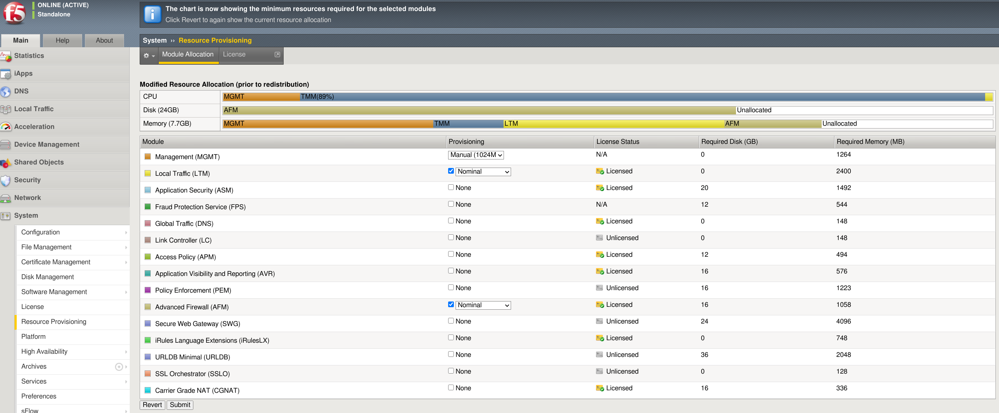

# F5 Address list

## Variables required

### Dependencies

Install `f5networks.f5_modules`.

```bash
ansible-galaxy collection install f5networks.f5_modules
```

### AFM Enabled on the FW

In the GUI (https://<ansible_host>:8443/tmui/login.jsp) Go to **System**>**License**>**Modules**.




## Playbook

Latest version -> [address_list](address_list.yml). The following output might be outdated.

```yaml
- name: Manage address lists on BIG-IP AFM
  hosts: f5
  connection: local
  gather_facts: false
  vars:
    create: false
    bigip_provider:
      server: "{{ ansible_host }}"
      user: "{{ ansible_user }}"
      password: "{{ ansible_password }}"
      server_port: 8443
      validate_certs: false

  tasks:
    - name: Create an address list
      f5networks.f5_modules.bigip_firewall_address_list:
        name: foo
        addresses:
          - 3.3.3.3
          - 4.4.4.4
          - 5.5.5.5
        provider: "{{ bigip_provider }}"
      register: output
      when: create

    - name: Remove an address list
      f5networks.f5_modules.bigip_firewall_address_list:
        name: foo
        state: absent
        provider: "{{ bigip_provider }}"
      register: output
      when: not create

    - name: Display output
      ansible.builtin.debug:
        var: output
      tags: debug
```

## Output

The following output might be outdated.

```bash
 ⇨  ansible-playbook -i ../../f5-host address_list.yml --skip-tags=debug

PLAY [Manage address lists on BIG-IP AFM] ********************************************************************************************

TASK [Create an address list] ********************************************************************************************************
changed: [f5]

TASK [Remove an address list] ********************************************************************************************************
skipping: [f5]

PLAY RECAP ***************************************************************************************************************************
f5                         : ok=1    changed=1    unreachable=0    failed=0    skipped=1    rescued=0    ignored=0  
```

In the FW:

```ruby
# show running-config security shared-objects address-list
security shared-objects address-list foo {
    addresses {
        3.3.3.3 { }
        4.4.4.4 { }
        5.5.5.5 { }
    }
}
```

